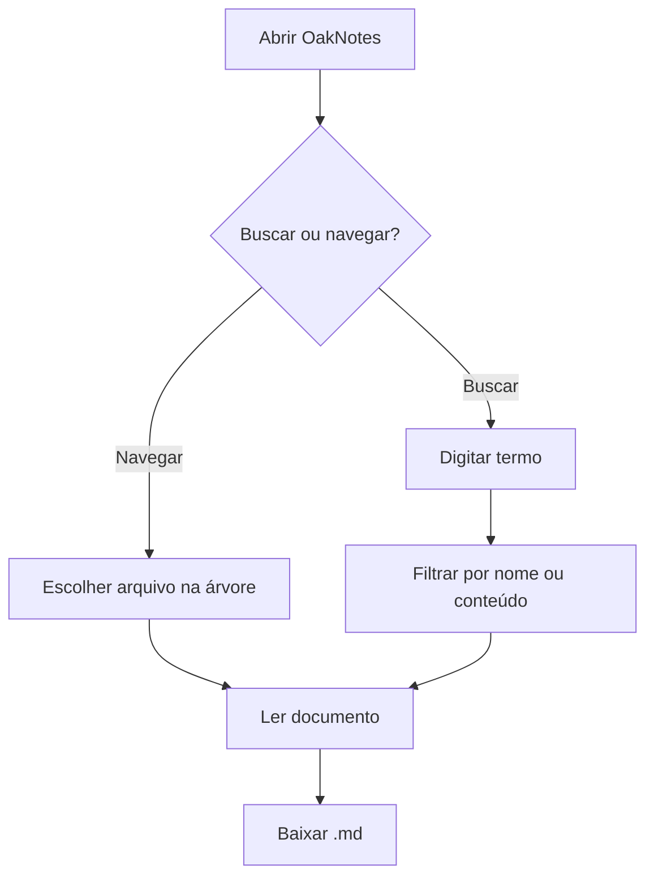
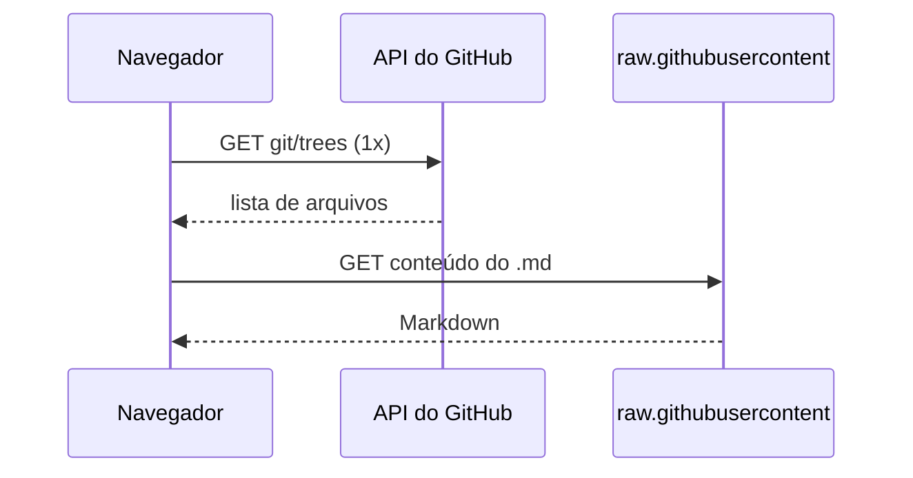

# Exemplo com Mermaid

Diagramas escritos em blocos ```` ```mermaid ```` são renderizados
automaticamente e seguem o tema (claro/escuro).

## Fluxograma



## Sequência



Voltar para [a página inicial](../bem-vindo.md).
